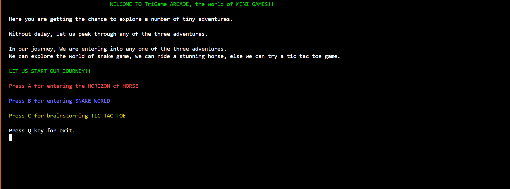
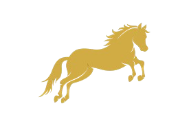
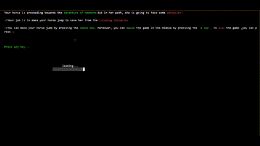
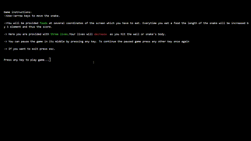
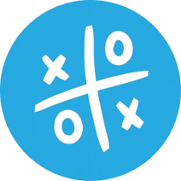
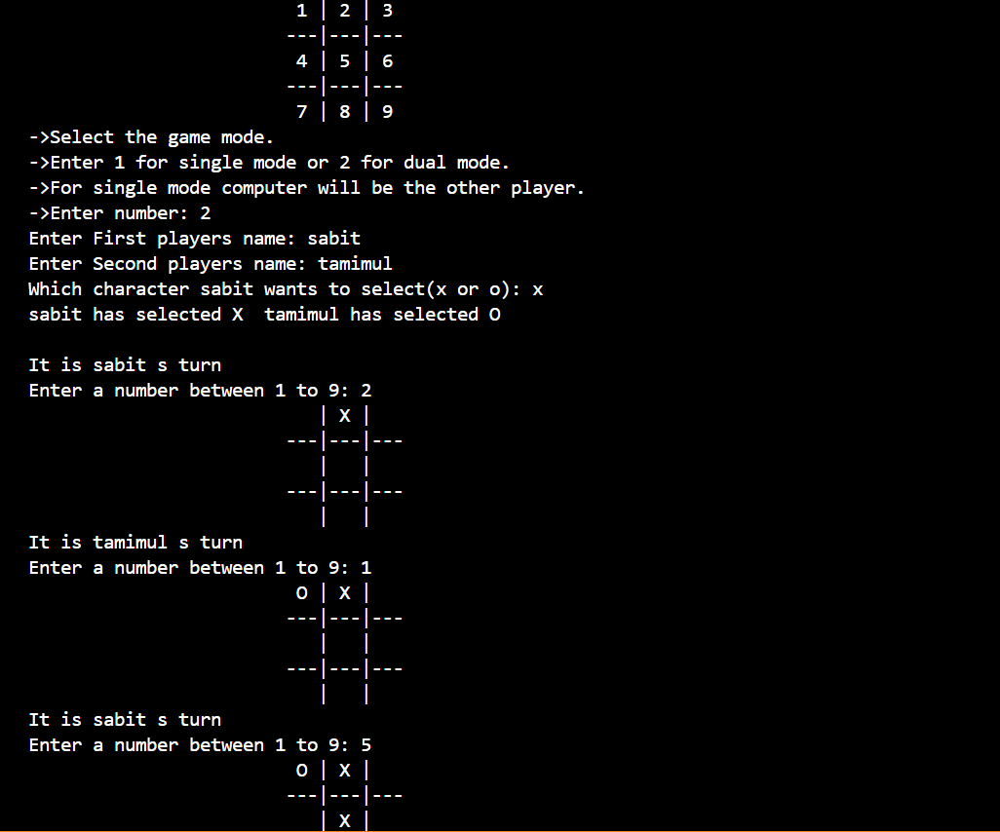

<h1>TRIGAME_ARCADE <a href="https://www.linkedin.com/posts/sabit-siraji-1732b9259_cprogramming-learnc-softwaredevelopment-activity-7329389903237013504-IU70?utm_source=social_share_send&utm_medium=member_desktop_web&rcm=ACoAAD-VIKcBqenpJyISCLU2OR4JE5312x8cMvQ" target="_blank">-Video Link</a></h1>

Welcome to our <strong> Combined Game Collection!</strong> In this project, we’ve merged three exciting games into one codebase: a horse game, a snake game, and tic-tac-toe. Whether you’re a developer or a player, we hope you’ll find this collection both creative and adventurous.

  

<h2> Games Collection</h2>
<ul>
  <li>🎠 HORIZON OF HORSE</li>
  <li>🐍 SNAKE WORLD</li>
  <li>🎌 TIC TAC TOE</li>
</ul>

<h2> HORIZON OF HORSE</h2>

    Embark on an exhilarating journey as you guide your horse through a series of challenging and dynamic obstacles. Test your reflexes, strategy, and precision as you navigate the course. Will you master the art of control and reach the finish line without stumbling or losing momentum? The adventure awaits!

  

<h2> SNAKE WORLD</h2>

    Control the snake, eat apples, and grow longer. But be careful not to collide with the walls or yourself! Navigate through increasingly challenging levels, collect bonuses, and aim for the highest score. Test your reflexes and strategic planning as the snake grows longer with every bite. Can you master the art of survival and become the ultimate Snake World champion?

  

<h2> TIC TAC TOE</h2>

    Play the timeless game of Xs and Os against a friend or the computer. Strategize your moves, block your opponent, and aim for three in a row to secure victory. Whether you’re playing casually or competitively, this classic game guarantees endless fun and challenges for players of all ages. Who will claim victory and prove their tactical brilliance?

  

<h2>🛠️ TECHNOLOGIES USED</h2>
<ul>
    <li>💻 Programming Language: C</li>
    <li>📚 Libraries: Standard C Library (stdio.h, stdlib.h, etc.)</li>
    <li>🛠️ Tools: GCC Compiler, Makefile</li>
    <li>🖥️ IDEs: Visual Studio Code, Code::Blocks, or any text editor with C support</li>
    <li>🔗 Version Control: Git</li>
</ul>

<h2>🚀 INSTALLATION</h2>

<h3>Prerequisites</h3>
<ul>
    <li>A C compiler like GCC (GNU Compiler Collection)</li>
    <li>Make utility (optional, for building the project using a Makefile)</li>
    <li>A terminal or command prompt to run the compiled program</li>
    <li>Optional: An IDE or text editor with C support, such as Visual Studio Code, Code::Blocks, or CLion</li>
</ul>

<h3>Steps</h3>
<pre><code># Clone the repository
git clone https://github.com/Sabit166/TriGame_Arcade.git
</code></pre>
Run the project using your IDE

<h2>📌 USAGE</h2>
<ul>
    <li>Launch the application.</li>
    <li>Navigate to the game you want to play: <strong>Horizon of Horse</strong>, <strong>Snake World</strong>, or <strong>Tic Tac Toe</strong>.</li>
    <li>Follow the specific rules of the selected game to achieve victory.</li>
    <li>After completing a game, enter your name to save your score as a record in a file.</li>
    <li>Press 'y' to view the saved records and compare your performance with others.</li>
</ul>

<h2>🤝 CONTRIBUTING</h2>

Contributions are welcome!

<ol>
  <li>Fork the repository</li>
  <li>Create a new feature branch: <code>git checkout -b feature-name</code></li>
  <li>Commit your changes: <code>git commit -m 'Add new feature'</code></li>
  <li>Push to the branch: <code>git push origin feature-name</code></li>
  <li>Create a Pull Request</li>
</ol>

Feel free to open issues or suggest improvements as well!

<h2>🫂 AUTHORS</h2>

  <strong>Horizon of Horse</strong>

  
  <a href="https://github.com/Sabit166" target="_blank">@Sabit166</a>

  <strong>Snake Game</strong>

  
  <a href="https://github.com/alif-ul-haque" target="_blank">@alif-ul-haque</a>

  <strong>Tic Tac Toe</strong>

  
  <a href="https://github.com/Tamim-Rizvee" target="_blank">@Tamim-Rizvee6</a>

